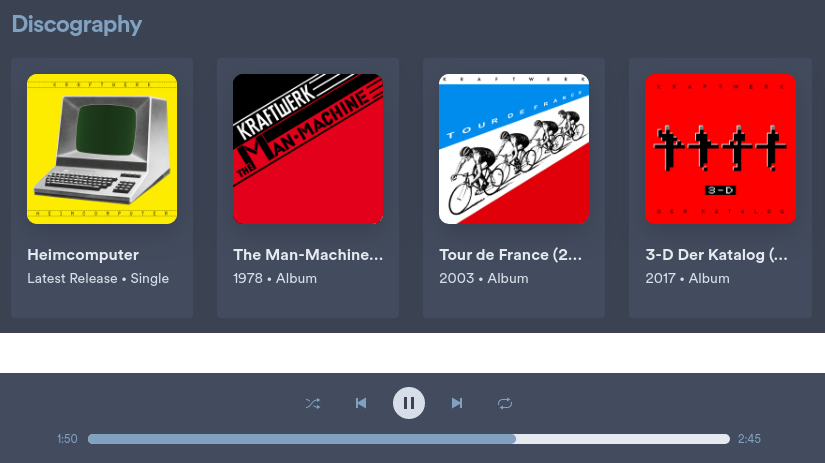

# Nordify - A Nord themed Spofity

A Spotify theme using the [Nord](https://github.com/arcticicestudio/nord) color palettes. This theme is initially based on the wonderful [Onepunch](https://github.com/morpheusthewhite/spicetify-themes/tree/v2/Onepunch) theme created by [okarin001](https://github.com/morpheusthewhite/spicetify-themes/commits?author=okarin001).

## Screenshots
### Main view of a playlist

### Cards and the player

### Artist info + calendar and the menu

### The wonderful spinning record

## More

#### How to use

- Install and configure [Spicetify](https://github.com/khanhas/spicetify-cli).
- Add this theme to the correct folder (read the Spicetify documentation).
- Run **`spicetify config courrent_theme Nordify`** and **`spicetify apply`**.

## Notes

This is still a work in progress, but quite usable already.
